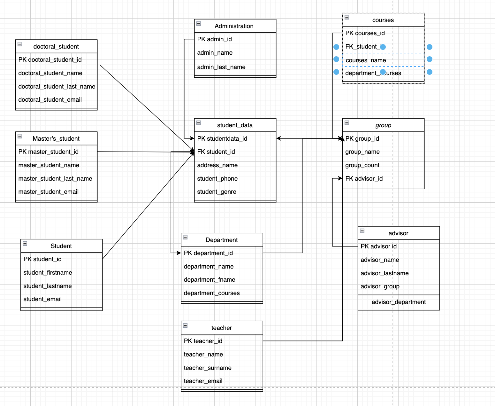

# University Admission Management System

## Mode
- Multi user login
- Crud (add, update, delete)
- Postgres SQL 

### Project Description
University Admission Management System is a web-based application built
with the aim of computerizing the admission procedure in universities and colleges.
The system proposed here incorporates handling and management of multi departmental and multi-divisional system that includes various daily activities in the
system
### UML Diagram project

### Compile project
1. mvn clean
2. mvn clean install
3. Go to the target folder
4. java -jar student_teacher_crud-0.0.1.war
5. Open http://localhost:8080/
### Credentials
- Default Teacher (**email** : teacher@mail.com , **password** : 123456)
- Default Student (**email** : student@mail.com , **password** : 123456)

## Screenshots
#### Login

#### Teacher

#### Student
