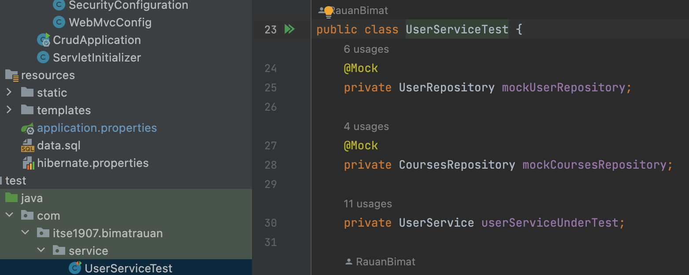
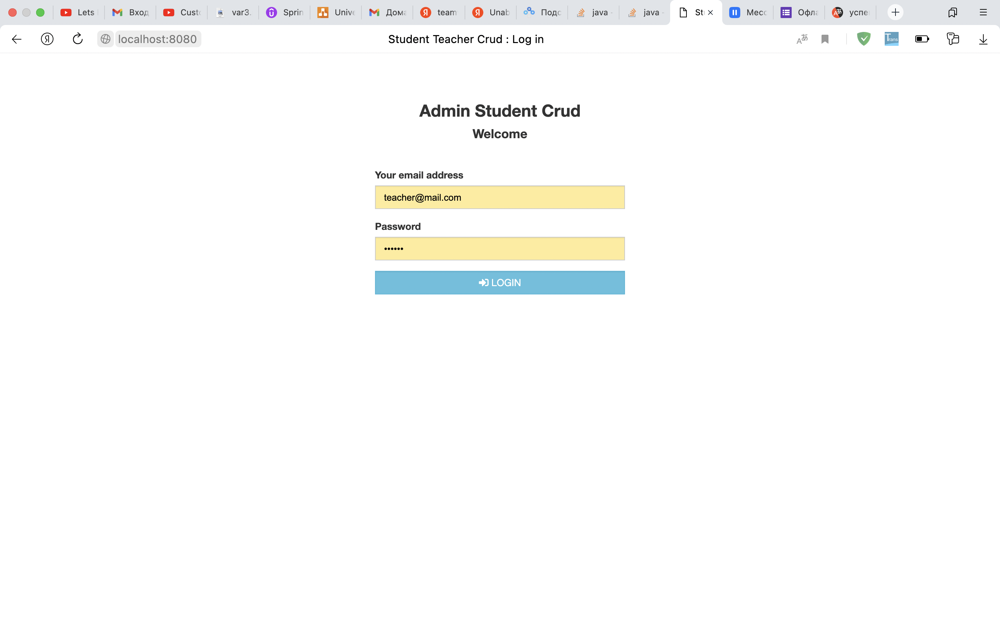
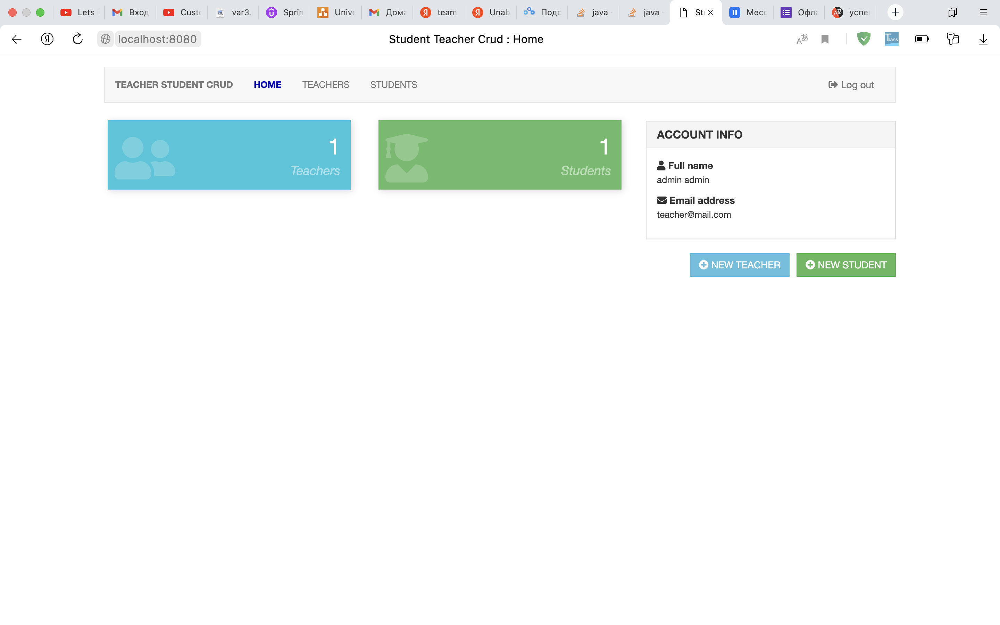
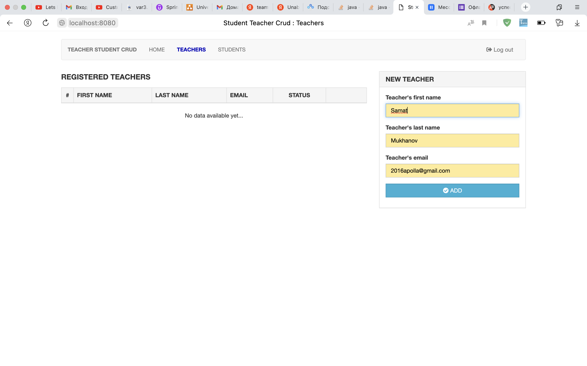
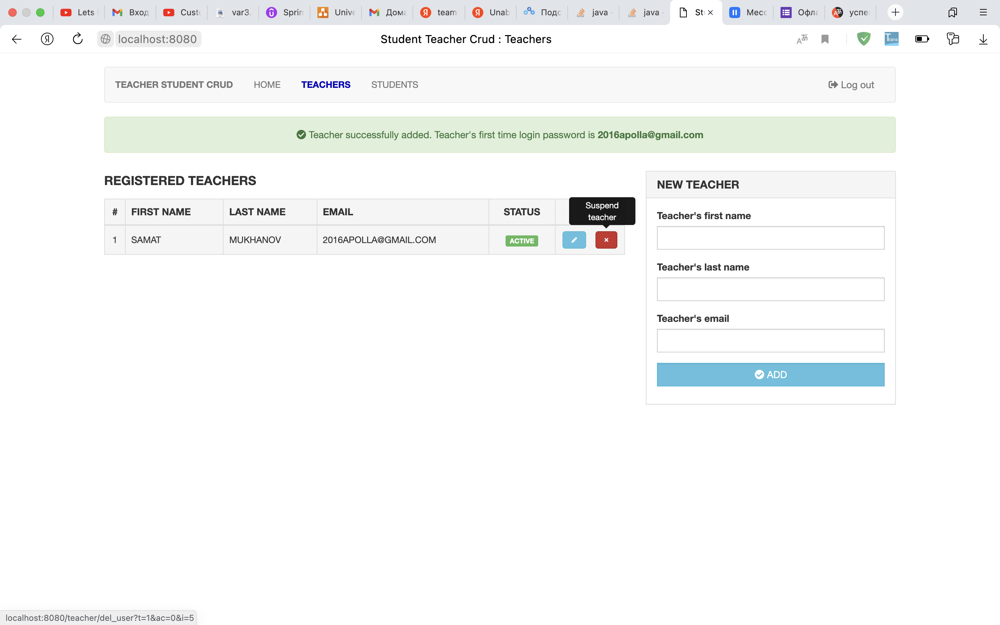
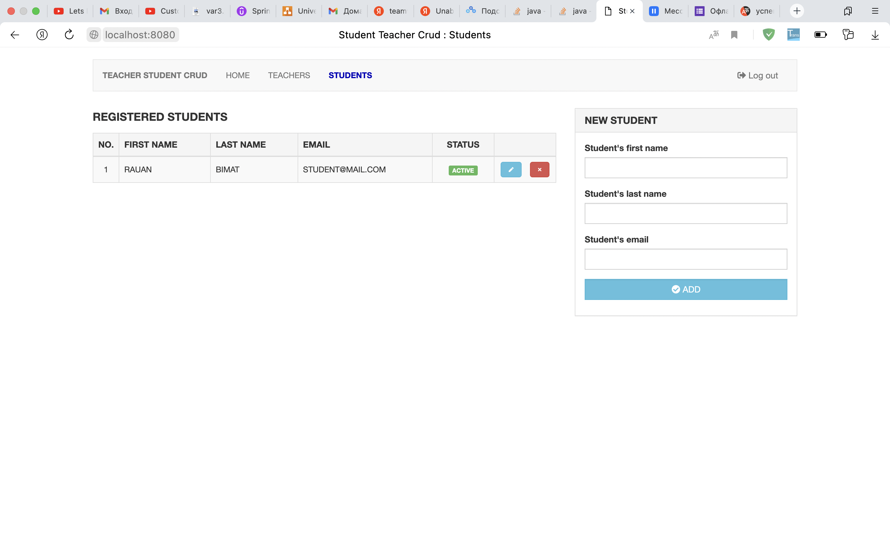
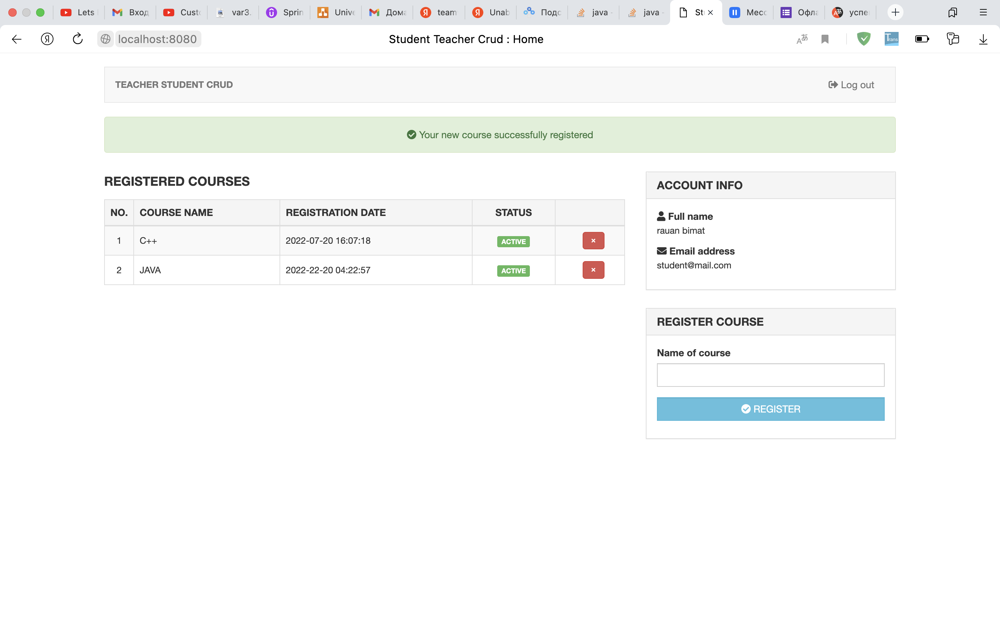

# University Admission Management System

## Mode
- Multi user login
- Crud (add, update, delete)
- Postgres SQL 

### Project Description
University Admission Management System is a web-based application built
with the aim of computerizing the admission procedure in universities and colleges.
The system proposed here incorporates handling and management of multi departmental and multi-divisional system that includes various daily activities in the
system
### UML Diagram project

### I have used technologies such as
- WebMVC
- SpringSecurity
- AspectJ
- Hibernate
- PostreSql
- jms
- pointcut
- html,css,js

### Accounts
- Default Teacher (**email** : teacher@mail.com , **password** : 123456)
- Default Student (**email** : student@mail.com , **password** : 123456)

## Screenshots

### JUnit tests

#### Login

In this screenshot I use WebMVCconfig technology and security configuration.There is also a password that is automatically encrypted
#### Welcome

When you go to the main page, you can see how many students and teachers are registered
#### Teacher

on this page you can see how many teachers are registered

but on this page you can see how you can add change the teacher's data and also delete it
#### Student

here you can see the list of students and also add, edit, delete

and if you go under the student login, you can see a list of subjects and also add